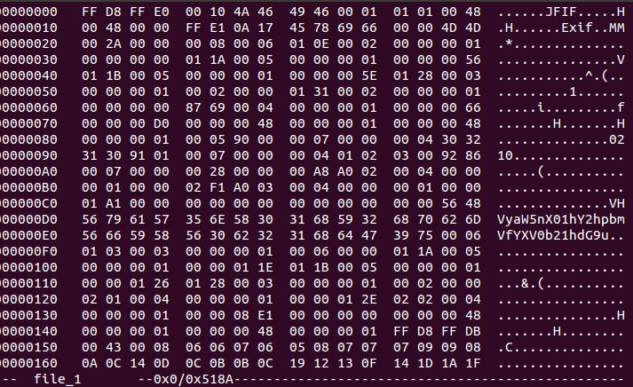
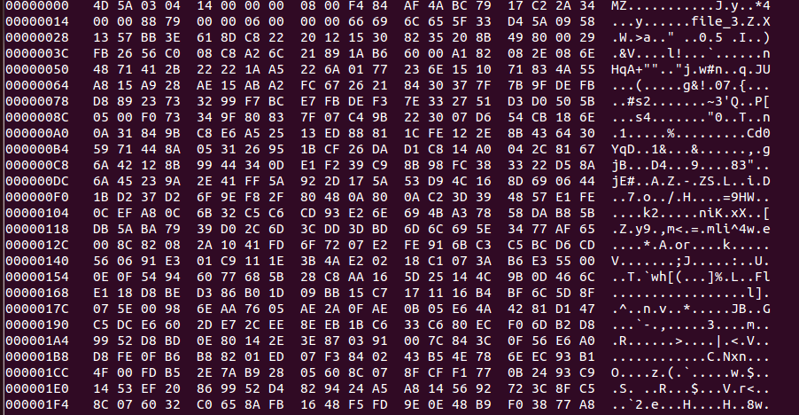
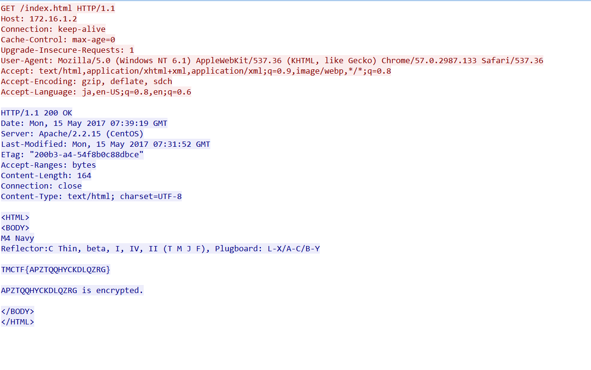

# TrendMicro: Analysis Offsensive 100

**Category:** Analysis Offsensive 
**Points:** 100 
**Solves:** 
**Description:** 

## Write-up

Unzip [file1.zip](file1.zip) then you will get a file named [Forensic_Encyption](./Forensic_Encyption). (As you see, here is a typo)

Encounter this kind of question. The first thing I do is use foremost or binwalk to check whether there are some secret files hidden inside.

After doing this, we can extract two files,[file_1](./file_1) and [file_2](./file_1).

file\_1 is a jpg file and file\_2 is a zip file which is protected by password

Using hexedit or xxd command you can see a weird base64-encode string in the jpg header.

We can easily guess that the decoded string is the password of file_2.

Then we have [key.txt](key.txt)

It seems like we should use this key to decrypt something. Let check Forensic_Encyptino again.

There is a file named file\_3. We can replace the "MZ" with "PK". Finally, we get a pcap file, [file_3](./file_3)

After decrypting, We found a HTTP responce which contains the flag information

The last thing is that go to [this site](http://enigma.louisedade.co.uk/enigma.html).

Then we retrieve the flag.

`TMCTF{RISINGSUNANDMOON}`
 
