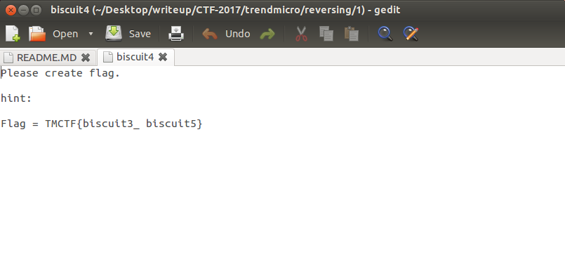

# TrendMicro: Reversing 100

**Category:** Analysis Offsensive 
**Points:** 100 
**Solves:** 
**Description:** 

## Write-up

Unzip [file13.zip](files13.zip) then get a zip file,[pocket](pocket).

Unzip pocket then get a rar file,[biscuit](biscuit)

We can extract two file,[biscuit1](biscuit1) and [biscuit2](biscuit2).

biscuit1 is an exe file. biscuit2 is a password-protected zip file.

Using IDA on biscuit1, we can find out that there is a function will generate password.

Using ollydbg, set the breakpoint after that funtion. And we can retrive the password.

`macaron`

Now we can unzip biscuit2. This time we have [biscuit3](biscuit3), [biscuit4](biscuit4) and [biscuit5](biscuit5).

Let's see biscuit4 first. It's a text file.

It's seems like we can retrieve two strings from biscuit3 and biscuit5.

biscuit3 is a jpg file. But there is a zip file is appended to it.

We can find [biscuit.txt](biscuit.txt) from that zip file.

biscuit5 is also a exe file. Using the same trick for biscuit3. we can retrieve the last part of flag.

`choux`

But the hint in biscuit4 is wrong.

Th flag is `TMCTF{choux_cream}`

